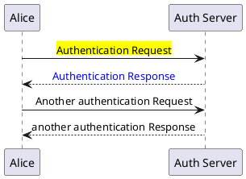

GitHub 블로그에서 PlantUML을 출력하는 방법을 정리한다.  

## PlantUML 소개
UML diagram을 그리는 무료 tool 중에 하나로, UML 내용을 text로 작성하면 (즉, 내용을 변경하거나 이력 관리가 쉬움) UML diagram으로 표시해준다. 내가 주로 사용하는 Android Studio, Eclipse, Visual Studio Code 등에서 플러그인을 통해서 쉽게 사용할 수 있고, doxygen으로도 출력된다.  
[`PlantUML 홈페이지`](https://plantuml.com/ko/)에서 도움말과 PDF 파일을 내려받을 수 있고(심지어 한글 버전도 있다! 🍺), Web에서 입력하여 바로 결과를 볼 수 있도록 online 에디터도 제공된다.

## 설치
우분투인 경우 아래와 같이 plantuml을 설치한다. (실제 실행 파일은 plantuml.jar 파일이므로 JRE도 설치해야 함)
```bash
$ sudo apt install plantuml graphviz default-jre
```
만약 최신 버전의 plantuml.jar 파일을 사용하고 싶으면 [`PlantUML 홈페이지`](https://plantuml.com/ko/)에서 최신 **plantuml.jar** 파일을 다운로드 받거나, 아래와 같이 wget 툴로 다운로드 받아서 사용할 수 있다.
```bash
$ wget https://jaist.dl.sourceforge.net/project/plantuml/plantuml.jar
```

## 로컬에서 테스트
아래 예와 같이 테스트 파일을 작성한다.
```jsx
@startuml
skinparam sequenceMessageAlign center
Alice -> "Auth Server": <back:yellow>Authentication Request
"Auth Server" --> Alice: <color:blue>Authentication Response
Alice -> "Auth Server": Another authentication Request
Alice <-- "Auth Server": another authentication Response
@enduml
```

아래와 같이 실행하면 동일 디렉토리에 PNG 파일이 생성된다.
```bash
$ plantuml <PantUML 파일 이름>
```
만약 PNG 파일 대신에 SVG 파일을 생성하려면 아래와 같이 `-tsvg` 옵션을 추가하면 된다.
```bash
$ plantuml -tsvg <PantUML 파일 이름>
```

## Markdown 파일에서 테스트
원래 PlantUML 내용 앞/뒤에 `plantuml` code block을 추가하여 작성하면 아래 예와 같이 PlantUML이 렌더링되어 표시된다.


## 블로그에서 테스트
[`jekyll-plantuml`]([https://github.com/yegor256/jekyll-plantuml) 플러그인 또는 [`jekyll-remote-plantuml`](https://github.com/Patouche/jekyll-remote-plantuml) 플러그인을 이용할 수 있다.
그런데 둘 다 local에서는 잘 되었으나 GitHub에서는 안 되었는데, GitHub에서는 security를 이유로 이 플러그인들을 로딩하지 않아서 발생하는 문제인 것 같았다.😪  
플러그인을 이용한 완벽한 방법을 찾지 못하여, 일단 PlantUML 파일을 로컬에서 SVG 파일로 렌더링하여 이 파일을 GitHub에 add 시키고 html 코드로 직접 이 파일을 출력하게 하였다. 단계별로 설명하면 아래와 같다.  
아래와 같이 PlantUML 파일을 SVG 파일로 변환한 후, assets/images/plantuml/ 디렉토리에 저장한다.
```bash
$ plantuml -tsvg <PlantUML 파일 이름>
```

이제 아래와 같이 html 소스를 추가한다.
```html
<p></p>
```

결과로 아래와 같이 diagram이 보여진다.
<p></p>

## DokuWiki에서 출력하기
DokuWiki에서 plantuml 플러그인을 설치한 후, 아래 예와 같이 `<uml>` 태그 사이에 작성하면 깔끔하게 렌더링된다.😋
```xml
<uml>
Alice -> Bob: Authentication Request
Bob --> Alice: Authentication Response
</uml>
```
